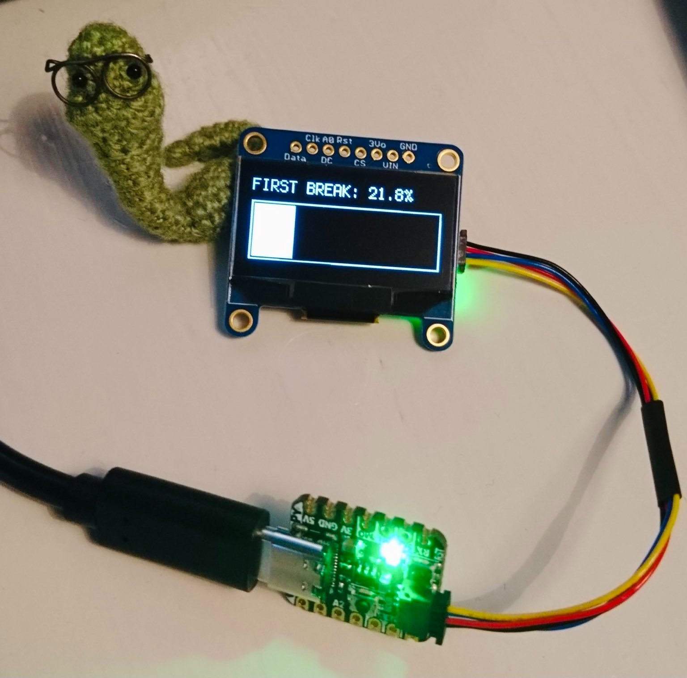

# Pomodoro-timer
A pomodoro timer running on a [QT Py RP2040](https://www.adafruit.com/product/4900) ([instructions](https://learn.adafruit.com/adafruit-qt-py-2040/circuitpython)) with a [128x64 OLED display](https://www.adafruit.com/product/938)

Written by [@horsto](https://github.com/horsto) with input from me and Phil
 
 

**Timer details:**

The timer will loop through the following intervals indefinitely, but can be paused at any time by pressing the BOOT button on the QT Py. Press the same button again to continue the timer from where it left off. To reset the timer, press the RST button on the QT Py.

| Interval      | Duration  | LED colour|
|:--------------|:----------|:----------|
| Focus (1/4)   | 25 min    | Yellow    |
| Break         | 5 min     | Green     |
| Focus (2/4)   | 25 min    | Yellow    |
| Break         | 5 min     | Green     |
| Focus (3/4)   | 25 min    | Yellow    |
| Break         | 5 min     | Green     |
| Focus (4/4)   | 25 min    | Yellow    |
| Long break    | 15 min    | Blue      |

---

